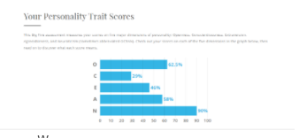

<h1>Introduction of Information Technology assignment 2</h1>

<h2>Team profile<h/2>
  
  
team name: Pancake Killers

  
  <h3>Personal Information:</h3>
  
  
Name:Suzhi Li

  
Student number:s3789222

  
My name is Suzhi Li and my English name is Sushi. It is a funny story of why I have this name but it is a bit long so if you are interested in it, you can go to my website. I come from China. For me, my hobbies are quite wide, I like playing video games, doing exercise, reading, even trying to write some stories and watching anime. At first, I wanted to apply Game Design but because of some surprise situations, I chose to study Information Technology at the end. However to be a game designer still is my goal and I will keep pursuing it in the future.

  
  
Name:Tao Zeng

  
Student number:s3654295

  
I come from China. I can speak Mandarin, English, Cantonese. This is the second years at RMIT.I don't have many hobbies, I only love skiing. In my country, skiing is not very popular. But I believe it will attract more and more people’s attention. I also hope to meet more people with the same hobbies.

  
  
Name: Zhenyu Huang

  
Student number: s3819233

  
My name is Zhenyu Hunag and my English name is paul.

  
I am from China. I can speak Mandarin, Cantonese and English. This is my first year at RMIT. I feel excited for my university life. I am interested in many things like video games, gyms or any outside activities. What I am trying now is to make myself more confident to speak english and meet new friends.

  
  
Name: Hongwei Zheng

  
Student number: s3636417

  
I was born in Amoy, China. A city which is very close to Taiwan. Therefore I can speak both Mandarin and Taiwanese. Like other teenagers I am addicted to video games, it is the part of the reason that I choose IT as my major in University. I am a team player and always like to make new friends online all over the world so I prefer muti-player games. I am also a fan of cycling, it is a convenient transport for my hometown because Amoy is a small Island.

  
  
Name:Haowen Wang

  
Student number:s3819216

  
I am from China, Chinese is my first language and this is my first year at rmit. My hobbies are swimming and computer games. Although I have not returned to Australia yet I still hope to make some friends through online classes, I think it will help me a lot in my future studies.

  
  
Name:Hao Zhong

  
Student number:s3806357

  
My Chinese name is Hao Zhong and English name is Howard. I come from China. This is my first year studying Bachelor of Information Technology in RMIT. My hobbies are playing games, watching movies and playing guitar.

  
  <h3>Test Outcome:</h3>
  
Suzhi Li:

    
  
  
  
Tao Zeng:

  
   
  
  
Haowen Wang:

   
   
  
  
Zhenyu Huang:

  
  
  
  
  
Hongwei Zheng:

  
  
  
  
  
Hao Zhong:

  
  
  
  
  <h2>Idea Job:</h2>
  
  
All our ideal jobs are IT related and have high salaries. All of these jobs require teamwork and good communication, as well as a knowledge of some programming language, or at least one. And some jobs also require the employee to have some working experience.

  
  
Although our ideal jobs are all related to it, they are in different fields. For example, the position of project manager is not in the studio most of the time. The project manager is more of a position of taking overall responsibility, like a leader leading the team.But for game developers, they need to master many related technologies, not only the programming language, but also the skilled use of 3D development tools and game engines.

  
  
Most of us will choose to be programmers, but some of us will not be in the relevant industry. May choose some do not need programming knowledge career, will choose other direction of development, such as project manager or consultant.

  
  <h2>Tools:</h2>
  
Group gethub:<a href="https://github.com/Tao-Zeng/Intro-to-it-G2">https://github.com/Tao-Zeng/Intro-to-it-G2</a>

  
Group Microsoft Team: 

  
<a href="https://teams.microsoft.com/_?culture=en-us&country=US&lm=deeplink&lmsrc=NeutralHomePageWeb&cmpid=WebSignIn#/school/conversations/%E5%B8%B8%E8%A7%84?threadId=19:977f686f9b5548fa90bc9b5049d671e4@thread.tacv2&ctx=channel&rootfolder=%252Fsites%252FEnglishB3%252FShared%2520Documents%252FGeneral%252FOral%2520Presentation%252FGroup%2520Folders%252FSushi%2520Kelly">https://teams.microsoft.com/_?culture=en-us&country=US&lm=deeplink&lmsrc=NeutralHomePageWeb&cmpid=WebSignIn#/school/conversations/%E5%B8%B8%E8%A7%84?threadId=19:977f686f9b5548fa90bc9b5049d671e4@thread.tacv2&ctx=channel&rootfolder=%252Fsites%252FEnglishB3%252FShared%2520Documents%252FGeneral%252FOral%2520Presentation%252FGroup%2520Folders%252FSushi%2520Kelly</a>

  
Wechat

  
Google Drive:<a href="https://docs.google.com/document/d/1ykthoQdL5564OStFZ_4n3lbs0NH5gMwCm5NFpquoZm4/edit?usp=sharing">https://docs.google.com/document/d/1ykthoQdL5564OStFZ_4n3lbs0NH5gMwCm5NFpquoZm4/edit?usp=sharing</a>

  <h2>Industry Data</h2>
  
  
Hongwei Zheng --database protection  Unlisted

    
  
Suzhi Li ---game developer  Unlisted

    
  
Hao zhong- Systems engineer Ranked #4 

    
  
Zhenyu Huang--java developer Ranked #7 

    
  
Tao Zeng-- project manager  Unlisted

    
  
Haowen Wang--Big Data Analytics  Unlisted

  
  <h3>database protection：</h3>
  
  
Linux/Unix

    
  
MySQL、PostgreSQL、Oracle、DB2、MongoDB

    
  
Shell、Perl、Python

  
  <h3>game developer：</h3>
  
  
Unity，UE4，problem solving, OpenGL,C++

  
  <h3>Systems engineer：</h3>
  
  
ospf ,rip ，linux，shell ,powershell，Python

  
  <h3>java developer：</h3>
  
  
JavaAPI，Java（I/O（NIO）、Socket、JDBC、XML）

  
  
JSP，Servlet，JavaSpring

  
  <h3>project manger：</h3>
  
  
Communication skills,planning,presentation skills

  
  <h3>Big Data Analytics:</h3>
  
  
SQL，SSIS，SSRS，Excel，Python

  
  <h3>IT-specific skills：</h3>
  
  
SQL--Ranked #1

    
  
SSIS(SQL tool) 

    
  
SSRS(SQL tool)

    
  
DB2(SQL tool)

    
  
MongoDB--Unlisted

    
  
Shell--Unlisted

    
  
Perl--Unlisted

    
  
Python--Ranked #22

    
  
Unity--Unlisted

    
  
UE4--Unlisted

    
  
OpenGL--Unlisted

    
  
C++--Unlisted

    
  
ospf --Unlisted

    
  
rip --Unlisted

    
  
Linux--Ranked #13

    
  
Java（I/O（NIO）、Socket、JDBC、XML）--Ranked #3

    
  
Javascript--Ranked #2

    
  
Html5--Unlisted

    
  
css--Unlisted

    
  
Excel--Unlisted

    
  
Business management--Ranked #7

    
  
Microsoft windows--Ranked #4

  
  <h3>General skills:</h3>
  
  
problem solving--Ranked #2

    
  
Communication skills--Ranked #1

    
  
Planning--Ranked #7

    
  
presentation skills--Ranked #15

    
  
Team work--Ranked #5

  
  <h3>The three highest ranked IT-specific skills which are not in required skill set:</h3>
  
  
SAP--Ranked #6

    
  
Building relationships--Ranked #8

    
  
Business analysis--Ranked #9

  
  <h3>The three highest ranked general skills which are not in required skill set:</h3>
  
  
Organizational skills--Ranked #3

    
  
writing--Ranked #4

    
  
Trouble shooting--Ranked #6

  
  
  
  <h3>Opinion:</h3>
  
  
Hongwei Zheng :I haven't changed my mind much, although my ideal career is not in the rankings, I think most of the careers in the rankings are relevant to my ideal career and even if I won't be doing database protection in the future, I can still do other jobs.

  
  
Suzhi Li ：Nothing has changed, I still want to be a game developer, that's my ambition. As a game lover, it is my dream to be involved in developing a game myself.

    
  
Hao zhong：There will be changes.I don't have a clear goal for my future work, I want to improve myself in my studies and find the job that really suits me and work towards it.

    
  
Zhenyu Huang：Same as Hao Zhong.I would like to understand the nature of each career, and the specifics of the career, before making a choice.

    
  
Tao Zeng：Nothing has changed because that's what my parents do and I think they can help me to understand and go deeper into this job.

    
  
Haowen Wang:Not much has changed, data analysis has always been what I wanted to do, I think I'm better at maths etc and doing the data side of things has always been on my mind.

  
  <h2>IT Work</h2>
  
  
Q1.Hi, we are students from rmit Information Technology and would like to interview you for some questions, first of all can you tell us about your job and what exactly you do?

  
  
Of course, I am currently a programmer working for Amazon. The main job is back-end development, mainly for business control and processing, such as accessing the database and making data updates to view changes. The main things to consider are how to implement the functionality, access to the data, stability and performance of the platform, etc.

  
  
Q2.Is there any other work you need to do?

    
  
It's mainly about which elements I've described above, writing code and implementing some functionality. If I had to say anything else, it would be the need to attend some internal meetings.

  
  
Q3.Who do you need to communicate with in your general work?

  
In internal meetings like the one I just mentioned, I usually have to communicate with the boss, the operations engineer, the operations and maintenance person or the front-end programmer, and sometimes with the users.

  
  
Q4.Can you tell us what you usually discuss in your communication with other people?

  
First of all you need to understand the role of each department. Our back-end engineers write the code and  operations , maintenance engineers deploy and monitor it, so communication with them usually revolves around the code. With the product managers, we will mainly discuss customer requirements and discuss business logic; with other programmers, we will discuss code reviews and help each other.

  
  
Q5.What aspects of your work do you spend most time on? Please tell us about these.

  
Programmers spend most of their time in front of a computer, where we are constantly working on fixing the wrong code, as well as writing new ones.

  
  
Q6.What do you think is the most challenging aspect of a programmer's job?

  
It is still mainly the process of writing and modifying code, and the fact that computer technology is updated at such a fast pace that we all need to keep learning.

  
  
Q7.It was a very good interview experience, can you give us some advice at the end?

  
It's a good idea to define your direction before you work and ask yourself what type of work you actually like. And you need to keep learning and improving your skills.

  
  <h2>IT Technologies:</h2>
  <h3>Autonomous vehicles: </h3>
  
What does it do?

  
Autonomous vehicles, as be called self-driving car, driverless car or robo-car, as its name, the function of this system is to let the car move safely with less even without any person. The history of Autonomous vehicles can be retrospected to between 1920s to 1930s and the first Autonomous vehicles appeared in the 1980s. 

  
Nowadays, In the USA, the organization call NHTSA divide six rank for automation driving:

  
Rank 0: No automation driving, it means that the driver must totally control the whole mechanical engineering and physics function, even another function which does not affect the driving like a warning system etc.

  
Rank 1 (‘hands on’): The driver controls the car but some of the functions can work automatically like ESP or ABS to keep the driving safe.

  
Rank 2 (‘hands off’): The driver monitors the driving and prepares for any immediate situation and an automated system takes full control of the vehicle to relieve the driving difficulty like ACC, ATS, LDWS and AEB etc.

  
Rank 3 (‘eyes off’): The driver needs to prepare to control the car in any possible time. Sometimes the vehicles may move automatically like during following cars but when the vehicles detect any urgency situation which needs the driver it will immediately let the driver take the control for follow-up situations.

  
Rank 4 (‘mind off’): The driver can let the vehicles totally automatically drive, when the system starts, the driver almost no need to get involved, the car will follow the original decided way moving and execute works like swerve, changing lane and speed up etc. However, when during severe weather, the road of fuzz, accident or the automatically driving way is finishing, the automation system will offer enough turning time for drivers.

  
Rank 5 (‘steering wheel optional’): The driver no need to sit in the car and do not need to control the car anytime. The car can automatically start the automotive driving system, choosing the ways and executing every function which connects to safety, even the situation which depends on one in the car. It no needs to be controlled by the will of the driver, it can control by itself.

  
For nowadays, most autonomous vehicles are at rank 1 or 2, only less of them reach rank 3. 

  
For example, in 2018, Audi showcased a world-first for production level 3 autonomous vehicle in the Audi A8. For this car, there is a function called ‘Traffic Jam Pilot’.To start the function, there is a button called ‘Audi AI’, when you push the button, the 'Traffic Jam Pilot’ will start to work. It will begin to steer, accelerate and brake on its own and work with the max speed of 60km/h. Moreover, it also can keep to the left of the lane at lower speeds for allowing safe passage for emergency vehicles and other non-motor vehicles. Also will move to center with speed increasing.

  
In further development, some famous companies like Tesla plan to research higher autonomous vehicles and show a level 4 full self-driving video in 2019. Not only Tesla plans to research higher level of autonomous vehicles, other famous companies like Jaguar, plan to detour autonomous vehicles in 2024, Daimler and Ford plan to destroy fully autonomous vehicles at market in 2025 and IEEE specialists forecast more than 75% vehicles will be automated by 2035. 

  
To make this happen, AI technology, more advanced ultrasonic, radar and laser sensors technology will be needed. Because for autonomous vehicles, they need ultrasonic, radar and laser sensors to acquire immediate information around the vehicles, then, it needs high intelligence and effective AI to dispose and correctly reflect at a blind of time. Thus, these technologies are important to reach the goals.

  
  
What is the likely impact?

  
  
One major potential impact will be about significant health and safety benefits, this technology may reduce the traffic accidents and fatalities. A study of a recent McKinsey & Company found that autonomous vehicles and advanced driver assistance systems may reduce motor vehicle death by 90 percent and decrease the more than $190 billion every year in health care costs. 

  
Based on this change, some insurance companies conducting business will be influenced. By the effect of autonomous vehicles, the human-caused accidents would decrease. Some insurance companies might rethink traditional business models. Like Google, Mercedes and Volvo, they have stated a new self-insuring for their own products.

  
For the people part, the people who will be most affected will be the people who work in transportation and medicine. The amount of traffic accidents will be reduced by the increasing autonomous driving system. Moreover, when every car popularizes autonomous driving, the frequency of traffic guidance will decrease too. It will reduce the pressure of transportation and for each country. The medicine part will be affected by this situation too. When the number of traffic accidents decrease, the amount of people who die and be hurted will reduce too. By the change, medical workers will reduce the stress not only from the physics part but also for the psychological aspects.

  
In the job part, autonomous vehicles will make a serious negative for some traditional jobs. For example, by the increase of autonomous vehicles, the expenditure for owning autonomous vehicles will be cheaper and cheaper. Thus, more and more people will have the ability to own autonomous vehicles.Moreover, autonomous vehicles are easier to be used and studied so autonomous vehicles will cause the situation of every one can get around with their own car. In this situation, the driver’s job will be strongly impacted because no one needs a driver anymore, the job will decrease fastly even disappear in the end. This situation not only happens in private, but also will happen in some companies like farming or mining industry etc. With the increase of technology, each large machinery will use the technology too. Thus the person who is trained to use the machineries will be no longer needed anymore.

  
  
How will this affect you?

  
  
For most of the private people,this technology will mainly affect their daily life. First effect will be the ways of the trip. By autonomous vehicles’ popularization, driving licenses will be more easily taken. People’s main trip mode will be using the car. Moreover, using these cars will decrease the danger of driving, by the help of the system, there will be less even no fatigue driving any more. Less traffic accidents will enhance people’s happiness index. Second will be time management. In traditional driving, people need to focus on controlling the car during driving or it will be dangerous. However, by the help of autonomous vehicles, people will have a chance to do other things during the trip like studying or preparing for further work. It will increase efficiency. 

  
For a family or friends. Road trip is one of the activities for a family or a group of friends. However, before arriving at a goal place, the journey may be boring and stressful. With the help of autonomous vehicles, family members and groups of people can do many things during the journey. It will make a journey much fun and close the distance between each person. Moreover, autonomous vehicles need a high level of AI technology, high advanced ultrasonic, radar and laser sensors technology. Studying technology will increase the understanding of other parts.

  
References:

  
En.wikipedia.org. 2021. Self-driving car - Wikipedia. [online] Available at: <https://en.wikipedia.org/wiki/Self-driving_car> [Accessed 18 April 2021].

  
Ohio University. 2021. 5 Effects of the Adoption of Autonomous Vehicles | Ohio University. [online] Available at: <https://onlinemasters.ohio.edu/blog/5-effects-of-the-adoption-of-autonomous-vehicles/> [Accessed 18 April 2021]

  
CarAdvice.com. 2021. 2018 Audi A8: We've driven the world's first Level 3 autonomous vehicle | CarAdvice. [online] Available at: <https://www.caradvice.com.au/581052/2018-audi-a8-weve-driven-the-worlds-first-level-3-autonomous-vehicle/> [Accessed 18 April 2021].

  
Faggella, D., 2021. The Self-Driving Car Timeline - Predictions from the Top 11 Global Automakers. [online] Emerj. Available at: <https://emerj.com/ai-adoption-timelines/self-driving-car-timeline-themselves-top-11-automakers/> [Accessed 18 April 2021].

  
  <h3>Cyber security </h3>
  
  
Information technology is always an essential way which improves people’s livelihood since it was created. As time has gone on, people literally realized that the computer and the internet have become the most important component of their life, even in the world. However, the internet world is huge, it controls the private information of everyone who has direct or indirect access to the internet. So naturally there also exists a hidden peril just like this world, there are the good man and the bad. A part of people always wants to allocate personal details or secret intelligences to reap staggering profits through illegal means on the internet. Like they sell people’s phone number and home address for some organizations. When they get this information, it will be easy for the staff to defraud or promote the sale of goods. Cyber security is born from an event. A researcher, Bob Thomas, who created a program called Creeper. This program can run in Arpanet’s network, leaving a trail whatever it went and engraved a sign, it read “I’m the creeper catch me if you can”. Ray Tomlinson, the inventor of email, wrote the program reaper, which chased and deleted the Creeper. The Reaper is the first example of antivirus software and also the first self-replicating program. Thus, it becomes the first-ever computer worm. Cyber security is a technology of protection systems to obstruct the cyber-attacks or outside users of unauthorized access. As technology has become more accessible, threats like hacking have become more prevalent. Meanwhile, the interaction brings that as more antivirus scanners hit the market. The continuing of cyber-attack and cyber-defend set off the rapid development of both technologies. According to the HISCOX small business cyber risk report, forty-seven percent of small businesses suffered at least one cube attack in the past 12 months and the rest are suffering more unknown internet’s risks. Obviously, it is expected, comparing the big companies that the small companies were easily invaded. Because, they do not have enough funds as many as big companies to employ the specific staff and create a department for their interior network maintenance. Sometimes for large corporations, a data breach could be the end of a company. Thus, that is why they attach importance to cyber security.  With the internet available in more homes and offices across the global, cybercriminals had more chances to utilize software vulnerabilities to steal customers' information. The 2010s, many cases of intentional cybercrime affected most of the country's security, moreover, it brought over hundreds of millions of losses by some enterprises. A lot of programs had already been developed for computer virus deletion and digital self-defense. Most of them were installed in software, either it provides initial protection by setting up a firewall to scan computers for viruses, worms, and Trojan bourse. And also, the effective way what we tend to do for cyber security at now, is having a strong password. Because it is a common method that hacker’s access other companies' systems through password stealing. Thus, a powerful and firm password is the most effective way to protect your private information. As cybersecurity developed to tackle expanding range of attack methods, those attackers also solved new means: multi-vector attacks and social engineering. Attackers become smarter thus cyber security were forced to innovate, the next generation. Next-gen cyber security uses different ways scanning unknown threats, while also reducing the number of false positives. One of the new technologies is multi-factor authentication. Basically, it works by adding an extra layer of security to your account that prevents someone if having your password and permits access from logging. For instance, when you log in to an online account, you provide a password and need to offer a second piece of information about what you were setting before.

  
  
As cyber security develops, the competition of trade will become fiercer. Like both different rival companies can take network warfare, they hire scientists and technicians’ staff by information stealing and destroying attacks launched by such malware as viruses. But development can bring another chance, more job applications. Information security analysts protect networks from cyber threats, they will analyze, assess, and investigate vulnerabilities in software systems and help to protect information and systems against any relevant threats in order to innovate more strong defense devices. These cyber security analyses are important for social development, because they can protect the information of underprivileged social groups to avoid the information falling into bad guy hands. As more of our information is stored into a place. As cyber security develops, the threat is also coming. And network security must adapt to the new threats at any time. Imagine what would happen if we did not have cyber security, everyone's private information could be exposed. In addition, cyber security can save people’s life. In the near future, automation will be popular to replace some complex operations such as driving cars, exploitation of mine and high-risk motivations. Self-driving cars are what our report wants to achieve but imagine that if someone hacked into a car's driving system, they could cause a big traffic accident, even kill their life. This is not only about information theft, but also life or death situations. Literally, the huge requirements of cyber security in every industry. Because, at present, the internet is like a web to contact around us. For example, customer details of shops, staff management and banking systems all were needed.

  
  
Cyber security affects me all the time. In the context of the report, I mention that cyber-infrastructure connects anywhere at present. What I do in my daily life is using the computer and phone, they are already becoming my life's component. Because of various reasons, we all need to attend class online, so I log in to my student account every day. Therefore, I frequently use phone apps such as Instagram, WeChat, and teams to communicate with my friends or group mates for daily interactions. Those things are able to make life easier and more effective. It is hard to imagine without the internet. Cyber security exists for management of those apps that can be stable running. Without cyber security, hackers would be able to access my account and steal all my personal information and make trouble in my life. Such as photos or text messages leaked onto public platforms. The elderly and children both are the most vulnerable groups, which was extorted easily by cybercrimes. They lack the security awareness of the network. It is a big part of them, which do not have abundant experience to guard against theft. For example, cybercriminals claim that a payment needs to be made because your children break a law and they have been in an inquest. Thus, you need to put up bail for releasing. When the victim can be tricked into transferring the funds to a bank account, the victim will be aware of the scam although it is far too late. As technology develops, cybercrime will become more sophisticated and effective.

  
  
References:

  
  
Katie Chadd, 24 November 2020. The history of cybersecurity https://blog.avast.com/history-of-cybersecurity-avast.

  
Hiscox.com. (2019). [online] Available at: https://www.hiscox.com/documents/2018- Hiscox-Small-Business-Cyber-Risk-Report.pdf [Accessed 1 May 2019]. 

  
  <h3>Blockchain and cryptocurrencies: </h3>
  
  
News about blockchain and cryptocurrencies has become a popular topic in recent years. 

  
  
When news about cryptocurrencies comes out, it is often dismissed as a scam and a bubble. There is no denying that there have been a lot of scams in the cryptocurrency market over the past few years. We can also see this in the price of cryptocurrencies. But as the industry continues to evolve. More and more people are beginning to pay attention to the technology and the market. Blockchain is the technology that is made up of Bitcoin.Therefore, cryptocurrency and blockchain cannot be completely separated from each other. The two are coexisting. The emergence of the Internet has elevated the development of the world to a higher level.The Internet has changed the way people access information, allowing information to be free of barriers. The Internet solves the problem of people's information asymmetry.Blockchain solves the problem of trust between people.A blockchain is like a train, where each carriage represents a block and is then linked to each other by cryptography into an ever-increasing chain. The Transaction Hash, Status, Block number, Timestamp, the sending part, the receiving part, and input data are all available in a Block.Cryptocurrency is a new type of digital asset. Users can create a wallet themselves and remember the wallet's private key. They then transfer the cryptocurrency purchases to their wallets for storage. Or it can be transferred to a digital currency exchange for trading at any time. Compared to traditional assets such as gold, cryptocurrencies are portable and highly liquid.Cryptocurrencies use blockchain technology, a decentralized way of keeping accounts. It is the complete opposite of the traditional banking system.In some underdeveloped countries, the national monetary system is relatively failed, and people's wealth will suffer devaluation every day. Out of distrust of the banking system, people will use cryptocurrency such as bitcoin to store their wealth.This also reflects the point of decentralization in the blockchain.Both blockchain and cryptocurrency have three attributes: anonymity, decentralization, and information is not tampered with.The use of cryptocurrency is now also very much, more as a currency transfer. Suppose Ben is an American who wants to immigrate or settle in Japan for a long time. He wants to change the US dollar into the Japanese yen. He has two choices, the first is to go to the bank to exchange, but the bank can not completely exchange into yen, it takes a long time and tedious. The second way is to go to some financial institution to exchange, but in this case, the cost of handling fees is quite high, and Ben have to bear certain risks. Obviously, these two situations are not feasible for Ben. Then Ben can buy bitcoin in the US cryptocurrency exchange, such as coinbase. Then he can create his own cryptocurrency wallet and record the private key. Put the bitcoin he bought into his wallet and keep his private key. When Ben arrives in Japan, he can register his account number in Japan's cryptocurrency exchange and transfer his bitcoin to the exchange in exchange for yen. This event shows the role of cryptocurrency in value storage, and shows the decentralized role of cryptocurrency and solves the trust problem.

  
  
Blockchain and cryptocurrency essentially coexist, cryptocurrency is the embodiment of blockchain technology. The development of blockchain is also the development of cryptocurrency. It's like the relationship between a car and a tire. The most successful cryptocurrency is bitcoin. Bitcoin is the most famous cryptocurrency with the largest market value. Behind it is the maintenance of countless developers and miners.Bitcoin is also the most successful experience in blockchain. Without bitcoin, people in many backward countries are still enduring the depreciation of wealth and the decline of purchasing power.Bitcoin is also recognized by more and more institutions in the traditional financial industry, and a lot of bitcoin related ETFs are gradually getting some attention in the financial market. There are many institutions, funds or individuals gradually pay attention to and recognize cryptocurrency.But it is undeniable that there are still many fraudulent and financial bubbles in the market of encrypted currencies, but the development of everything must go through these stages.In the next three years, we may see more bitcoin related funds or asset allocation. Bitcoin will also become a mainstream asset in the public's choice. And as long as the blockchain can be accepted by the public,Blockchain technology will also get more applications, such as in food traceability, art anti-counterfeiting and so on. 

  
  
There are many problems in the development of blockchain, and the attitude of various countries towards blockchain is not very friendly. Because there are a lot of scams around the blockchain, which is also the concern of the government. The public is also worried that blockchain will bring more negative effects.Cryptocurrency is the product of blockchain, and it is also the future of currency. Countries now have plans to study their own digital currency, so the use of digital currency is more secure. And once cryptocurrency is used, it will be easier for the government to control financial crimes or illegal transactions.If blockchain technology is applied in the future, it will be closely linked with our life. Artists can use blockchain technology to authenticate their works and get their own hash number through blockchain. In this way, users won't have to worry about the fake in the future.There is also the food industry, consumers want to see imported food is really transported from the origin. Consumers are afraid to buy fake imported food. The application of blockchain technology can trace the source of food. Food companies can record the data of each item, including the production date and specific production line, and upload them to the blockchain. In this way, consumers can find out the place of production and specific products when they buy.In some aspects of authoritative authentication, blockchain can also play a role. The government can authenticate some qualification certificates, such as education or business license for blockchain authentication.

  
  
In the near future, if blockchain and cryptocurrency can be widely used, it will bring a lot of convenience and higher efficiency. For me, it will be related to my life, my major and my future industry are inseparable from blockchain.Maybe in the future, I will be exposed to the work of information security. I think blockchain can make information more secure, which is an innovative technology. I think it will greatly improve the whole industry. We always hear that a certain website or company has been attacked by hackers, resulting in the destruction or loss of data. These problems are caused by the concentration of software servers, which will cause serious losses once attacked. If in the future, blockchain is applied to information security, making the data records become decentralized.In this way, hackers' attacks can cost a lot, and thus avoid many losses.In the future, the government will adopt cryptocurrency. For me, it will make my daily shopping and international trade more convenient and security. For everyone, it improves the quality of life, makes people more trusting and efficient. For members of my family or friends, I don't need to worry about whether they will suffer from financial fraud, because the behavior on the blockchain can be found. Just check the data on the blockchain to track the flow of money and monitor it. The development of blockchain and cryptocurrency has been accepted by the public. Maybe in the near future, it is a mainstream thing to apply cryptocurrency

  
  
References

  
FLOVD, D., 2021. How Bitcoin Works. [online] Investopedia. Available at: <https://www.investopedia.com/news/how-bitcoin-works/> [Accessed 24 April 2021].

  
DiCamilo, N., 2021. NYSE Files to List Shares of Valkyrie's Bitcoin ETF - CoinDesk. [online] CoinDesk. Available at: <https://www.coindesk.com/nyse-files-to-list-shares-of-valkyries-bitcoin-etf> [Accessed 24 April 2021].

  
lm, F., 2021. Top South Korea Regulator Says All Crypto Exchanges Could Be Closed - CoinDesk. [online] CoinDesk. Available at: <https://www.coindesk.com/south-koreas-top-financial-regulator-suggests-all-crypto-exchanges-could-be-shut-down> [Accessed 24 April 2021].

    
 

    <h3>Robot</h3>
    
 

    
What are robots？A robot is a mechanical device that automatically performs work, an intelligent machine that can work semi-autonomously or fully autonomously. It can not only accept human command but also run pre-arranged programs.

    
In 1956 George Devol and Joseph Engelberger formed the world's first robot company. By the 1960s robots were introduced into the General Motors automobile plant in New Jersey for moving car parts around.

    
In today's era, through the development of robotics technology, robots have become more and more versatile, and they have evolved from traditional industrial fields to military, medical, service, home appliances, and other fields. We can find that robots can be seen everywhere in our lives. For example, sweeping robots, food delivery robots in restaurants, and robotic arms in car factories, etc. For floor sweeping robots, people can set up a route for them to automatically start cleaning the room within a specified time, and automatically return to the charging place after the cleaning is completed; restaurant food delivery robots, when using them, you must first set each The position and number of a table, so that the robot can deliver food to the customer’s table based on this information; Robot arm robot, can improve the quality and output of products, but also to protect personal safety, improve the working environment, reduce labor intensity, improve labor productivity, save raw material consumption and reduce production costs, has a very important significance. With their existence, our lives are much more convenient, while reducing the need for labor. In addition, if there are some radiation accidents or people unable to carry out rescue accidents, the robot can come in handy. It can monitor the situation at the accident site and then transmit the information to the human console so that it can send instructions to the robot to allow they began to implement rescues.

    
In the next three years, self-driving cars may be introduced. An autonomous car is a vehicle capable of sensing its environment and operating without human involvement. A human passenger is not required to take control of the vehicle at any time, nor is a human passenger required to be present in the vehicle at all. An autonomous car can go anywhere traditional cargoes and do everything that an experienced human driver does. Self-driving cars rely on sensors, actuators, sophisticated algorithms, machine learning systems, and powerful processors to execute software. For example, radar sensors monitor the position of nearby vehicles; Cameras detect traffic lights, read road signs, track other vehicles and look for pedestrians. And ultrasonic sensors in the wheels detect curbs and other vehicles when they stop. When parking, instructions are given to automatically plan the distance and route. The software then processes all that sensory input, maps the path, and sends commands to the car's actuators to control acceleration, braking, and steering. While autonomous driving is convenient, it faces many difficulties, such as weather conditions and the inability of cameras and sensors to track lane markings when the lane divider disappears if snow falls on the road. Accident liability: if an autopilot crashes, who will be responsible, the manufacturer or the passenger; Lidar, which is very expensive, will be needed in large quantities to produce vehicles. Will the lidar signals interfere with each other on the road.

    

    
About impact of robot, If the technology of robots continues to develop, it will have a great impact on us. If robots are used in various industries in the future, it will prove that the factories that design and produce robots are highly skilled, because there are no obvious problems with the robots being used. At the same time, the profits of businessmen will be greatly increased and the economy of the country will also grow. In addition, if robots are used in all industries, many workers will lose their jobs. For example, Foxconn is the world’s largest contract manufacturer, It employs more than one million workers in China. In 2011, the company installed 10,000 robots, called Foxbots. Today, the company is installing them at a rate of 30,000 per year. Each robot is used to perform routine jobs such as spraying, welding, and assembly. On June 26, 2013, Terry Gou, Foxconn’s CEO, told his annual meeting that “We have over one million workers. In the future, we will add one million robotic workers.” This means that the company will avoid hiring those next million human workers.
This happens to prove that robots will replace workers and the world will enter the true age of technology. People can only do simple jobs at home. But some new industries will need a lot of talents, such as the programming industry, because designing robots, studying robots, and controlling robots all need to give them input instructions and programming code, so the people who learn to program will get a high-paying job.

  
  
Finally, In my daily life, robots can be seen everywhere. At home, I use the sweeping robot all the time, and it gives me a lot of time to do other things. And when I do not want to do housework after a day's work or want to relax for two days on the weekend, the sweeping robot can free me, do not have to spend a lot of time cleaning the room, the most important is that it can clean some more difficult to clean the place, such as under the sofa, under the bed and under the cabinet, etc. Having it really gives me a lot of time to relax. In addition, when I go to the mall, I will see the shopping guide robot standing at the door. If I don't know the location of the store, I just ask the robot and it will immediately map out the route so that I can see it at a glance. When I have other questions, it will also answer them by voice. From these two robots, let me convenient, with their existence, I think the future life will be better. The self-driving cars will also change my life, bring more convenience for driving, although it is not necessary for our young people, but for the old man this technology will help them. Because they can't get a driver's license, self-driving cars will make it possible for them to get around. They can visit friends and family, go to the doctor, and go shopping on autopilot. If self-driving cars bring safety and convenience to the elderly, I think many elderly people will also use them.

  
  
References

  
William h. D ＆ Michael s. M. Harvard Business Review 2014. What Happens to Society When Robots Replace Workers? Viewed 27 April 2021 <https://hbr.org/2014/12/what-happens-to-society-when-robots-replace-workers>

  
  <h2>Project Ideas</h2>
  
As of today, where advanced technologies ranging from AI driven bots to big data analytics systems emerge in great numbers and dominate a significant part of our daily lives, our society can be accurately defined as an intricate and complex environment filled with unprecedented inventions and breakthroughs in all possible sectors. Among these groundbreaking innovations, a notable one to mention is the AI-driven self-driving technology. This technology, which is mainly derived from the combination of intelligent AI systems and an enormous number of sensors including but not limited to radar, lidar, sonar, GPS, odometry, and inertial measurement units, has been widely applied and used in ample fields and settings. Its existence has enabled many intelligent and smart systems to be established which were then utilized by consumers of all backgrounds to meet their varied needs ranging from transportation needs, commute needs, auto-detection of objects needs, and more. With this context set in place, the ideas for our project are to build a smart self-driving software based on AI algorithms which will then be installed on matching hardware’s, hopefully most vehicles from notable brands on the market, to enable these equipment or vehicles to fully drive on their own without human intervention. To be exact, we would like to develop a software which utilizes advanced AI algorithms to help host vehicles automatically detect objects within its surrounding environment in order to enable it to not only drive on its own with safety in mind, but also to avoid incoming obstacles at all times and constantly gather external data which will later be used in the self-learning process so the software itself becomes more intelligent over time on a gradual basis. Ultimately, our end product will be a software that helps consumers to drive safety in their vehicles without need to intervene and at the same time becomes smarter through learning more about the complex environment it is within so it can continuously deliver better services for the clients.

  
  
As indicated, our product will be an AI-driven software that works on most brands of vehicles. To reach this goal, the following implementation process is necessary. First, we will establish an exclusive development team of our own six members where each member is hopefully an expert in one of the many areas that are associated with self-driving development. For instance, we would have an expert in back end development to handle API requests, servers, and database related issues, an expert in front end development who's responsible for the UI and GUI of the software, an UI specialist to handle the product aesthetics and exterior design process, an AI expert who is proficient in self driving algorithms so he can resolve issues of this space, and a math-oriented expert who can manage problems related to sensors calculations, data processing, and other mathematical issues. We need to closely examine each candidate’s individual competencies such as how well they can perform their tasks in the respective fields without obstacles and their technical expertise. If a candidate cannot deliver the technical requirements quickly and therefore produce quality-assured results, then the overall development results may be delayed or decreased in quality. On the other hand, we also need to perform a personality test on each potential candidate to determine if he can work well as part of the team. If the team members are unable to collaborate with one another in a unifying manner, it would become overly difficult for the team to work mutually toward the same goal, especially when this specific project requires constant and frequent collaborations among the team members since ample changes are required to be made as experiments of the product are conducted. 

  
  
Our members will work together in cooperation and aim to roll out a prototype product within a predetermined time, hopefully in two to three months. The key here is to initially hold group meetings to come up with a rough product design that absorbs many of the well-done features from existing products on the market so team members can then mutually work toward building the product that aligns with this first product design. During the process, on site and live experiments will take place so the product will be constantly tested and improved while it is being developed. It will go through an intense stage of trial and error as newer features are developed while poor features are either removed or enhanced. Two to three months later, hopefully the first version of the product will be entirely built out. At this point, it will be thrown into the market on a small to medium scale to determine how well it is able to adapt to the real market and meet consumers' critical and complex needs. After two to three weeks of in market testing, feedback will be collected, analyzed, and evaluated and the team will then hold another round of meetings to determine the next major steps to take. Whether to improve the product, add new features, remove certain product functionalities, adapt product to needs or demands, and more will all be determined at this stage. If there is no major setback against the product, the above process will be repeated every three to four months until the product reaches a stage of maturity where it is widely accepted and recognized by consumers and is able to yield considerable revenue for the company. Thus, the development stage of the product concludes. Apart from the setup of the team, the design and development stages, there is also the stage of testing which shall be closely defined here. The testing stage primarily consists of the steps needed to frequently test the product in real, not simulated, settings on a frequent basis in order to ensure that it not only functions correctly but also satisfy the complex needs of the consumers. The product should be sent out as testing samples to randomly selected users of different modern vehicles and then our company would ask these users to participate in our experiments. We will ask these participants to drive at specific intervals during times of their choosing while our software is being installed within their vehicles’ hardware. During these predetermined time intervals, we will ask our users to make notes of the driving experiences they are experiencing so they can later use these data to fill out questionnaires that we have prepared for them well in advance. They should consider issues such as whether the driving experience was smooth and unobtrusive, how well the software is able to direct the vehicle so all incoming obstacles are avoided on time to prevent accidents, how sufficient is the software in terms of its capability to learn from past data so it can perform better in future drives, how well the software is in terms of its competency to detect all kinds of foreign objects in the constantly changing external environment such as roadblocks, humans walking by, moving vehicles or objects, and the like, and more factors related to software’s overall performance, responsiveness, efficiency, and smartness. As users finish their given drives, they will then fill out surveys mentioned before which consist of thirty to forty simple questions that ask them to rate the different components of the software, or its level of performance, efficiency, capacity, and other performing factors. We will collect all data and analyze results from these results to finally produce a comprehensive report that indicates areas of improvement required for the software to perform better in future testing cases. To sum up, selection of team members, design stage, development stage, and testing stage are the four major procedures that need to be undertaken for our project ideas to be effectively and efficiently realized.

  
  
As highlighted, smart self-driving technology is one of the frontier innovations that enables consumers to drive without the need to intervene or manually control their vehicles. It is made possible through development of a piece of software based on AI algorithms and other sensory components and in our case, this would require the formulation of a small yet specialized. Team where each member will be responsible for a key piece of the product's entirety. The team will aim to make this product by going through the design, development, and testing stages. As for the actual implementation process, it will consist of the following procedures. First, we will select few of the highest ranked and regarded object-detection algorithms from GitHub’s most starred repositories so at least we are using algorithms that are already approved by the coding and engineering communities. Then, we will hold inner technical meetings to discuss which algorithm is more suitable for our use case, or common driving needs in our case. A intense meeting will be held between our engineers and mathematicians to examine this issue as technically as possible to ensure we are using the most effective and supportive algorithm possible. Then, we will have our software engineers design the actual product’s back end system and front end interfaces so they are developed on top of the selected algorithm. The back end system needs to handle requests from ample users at the same time and the front end interface needs to be beautifully crafted to ensure top notch user experience and aesthetics. Then, we will integrate the back end, front end, and algorithms altogether as in any normal software development process so it not only works but also is also capable of handling many concurrent user requests at the same time. As for the programming languages, we are likely to use C++ or Java to develop back end systems as they are capable of handling high user demands with high responsiveness and low latency. This way it will be assured that our product will respond quickly and efficiently to constant demands from users who are driving and demanding use of our software’s services. Meanwhile, embedded front end frameworks will be compared and contrasted and the most visually appealing one will be chosen to be used for our project. Once the initial prototype is designed and developed, we will run this app or software within simulated environments first to test for possible bugs and malfunctions. Once this rough version has been tested enough times so that it is capable of handling actual user demands in real driving situations, we will conduct in market testing where the app will be selectively distributed to participants’ vehicles and have them experience and rate the product. If all goes well, we will end up accomplishing a product that lets users drive most market vehicles effortlessly while ensuring that their safeties are always in check and protected within an acceptable time frame. It is expected that a mature, self-driving software will be widely distributed and used in the market quickly should all above steps transition well enough from one to the next without major setbacks. Moreover, we envision our product to be able to support consumers of modern vehicles to drive safely, quickly, and efficiently.

  
  <h2>Group Reflection</h2>
  
  
Suzhi Li

  
In my opinion, I believe that it is the best group, or at least is the best group in my experiment. In this group, I can clearly feel that everyone wants to work, and wants to make our assessment to be good. In this group, everyone likes to choose which part they want to work in an organized way and when someone needs help, others are actively and happily helping him. I know this is the basic part of teamwork but for me judging a team is good or not just depends on this basic part. Moreover, the best part which I like most is that I can learn a lot from the team. In my team, everyone’s intellection is emanative and everyone is friendly. We like to share our project ideas and talk about them to each other. In this time, we all can come out with some new ideas or make our original project idea more clean and more feasible. The most regrettable part will be our communication way. Because of the situation for now, we cannot do face-to-face communication. It affects our efficiency but thinking from the other side, if we can have this efficiency by communication only by the Internet, it further shows that it is a great team right?

  
  
Tao Zeng

  
My view of the team,   the group work went very well. Everyone has finished their own job. And everyone assigned the right part. The only thing that can be improved is that i think The team members did not finish the homework in time, which led to the overall speed becoming relatively slow.This is something we as a team should take seriously. In addition, to my surprise, everyone can complete their own work, everyone would like to help each other. When it comes to assigning tasks, team members prefer to take them on themselves rather than waiting for work. It's a positive team attitude. I learned through this teamwork that As a team leader, I need to take care of other people's ideas. I should be good at listening to the opinions of team members. I can't decide everything by myself. At the same time, I should be ready for everything. When our teammates need help, we should help them in time.Our communication is completed through social software, so we are not very efficient in formulating the team framework. But we are all willing to do our homework and take responsibility for it.

  
  
Hongwei Zheng

  
The group work went very well. By the first meeting we have assigned every part to each member and set a goal. We aim to finish the major works before the end of week 7 and we actually made it. Our group leader Tao helped us to arrange meetings and recordings. I think the only thing that needs to be improved is communication on MS teams is not enough. Everyone seems to be a very independent learner and our group lacks communication. There is one thing that surprised me, all of my group members are from China and English is our second language. During the first online meeting I was afraid that we are not able to talk enough time but actually at the end we found that we talked much longer than we expected. I have learned that team spirit will make a huge amount of work in order. When someone is having a problem, more than one member responds and is happy to give a hand. Overall, I really enjoyed working with these group members and hope we can achieve a good result.

  
  
Haowen Wang

  
This was the first group I joined at rmit University and at first I didn't know everyone's personality and was worried that we wouldn't work well together, but as it turned out, we worked together easily and happily. First of all, as we are all from China, there is no language barrier at all and we can all help each other with our problems very well. In our first meeting as a group, we defined everyone's responsibilities and the allocation process went smoothly and everyone was very positive. In the process of completing the assignments, although everyone was different in terms of efficiency, some did it quickly and some did it slowly, but overall everyone did a good job.

  
  
Zhenyu huang

  
In our group we have a wonderful collaboration. Because, we got a leader and he clearly arranged the working load for each group mate. Everyone actively cooperated with their part and finished their assigned work. I am so glad that my group mates are positive. We had chatted with each other about our assignment process. When I have some problems with what I am posted in group chat, they can always immediately reply to my question. Also, group mates love to help others when they are done with their job. But the problem we got is less real communication, face-to-face. I think face to face that it is a very helpful way to improve our group process. For me it is strange we got a meeting online, and the feeling is not good. In the group, I learned many things, arranged timetables and helped teammates as a qualified group leader.  My tasks for the assessment were to complete its technologies report and I chose cybersecurity and my friendly group mates taught me how to find out references. Overall, I enjoyed working in the group. 

  
  
Hao Zhong

  
I think our group is a very perfect group, because we have a group leader, he lets us choose what we want to do. Our progress was very fast, and all the team members finished their work in about a week. We can finish the homework in such a short time, which proves that all the members of our group are great, which surprises me. People in our group basically finish their own work by themselves, and we don't have enough group discussions, which is insufficient. But our group members are very united. If one person has a question, we will try our best to answer it. In addition, in our first meeting, at the beginning we thought the time allotted was too long and we were afraid that we could not meet the time allotted. But in the end we ran over the allotted time and everyone was expressing their opinions during the discussion, which really surprised me. I really enjoy working with them.

