<h1>Introduction of Information Technology assignment 2</h1>

<h2>Team profile<h/2>
  
  
team name: Pancake Killers

  
  <h3>Personal Information:</h3>
  
  
Name:Suzhi Li

  
Student number:s3789222

  
My name is Suzhi Li and my English name is Sushi. It is a funny story of why I have this name but it is a bit long so if you are interested in it, you can go to my website. I come from China. For me, my hobbies are quite wide, I like playing video games, doing exercise, reading, even trying to write some stories and watching anime. At first, I wanted to apply Game Design but because of some surprise situations, I chose to study Information Technology at the end. However to be a game designer still is my goal and I will keep pursuing it in the future.

  
  
Name:Tao Zeng

  
Student number:s3654295

  
I come from China. I can speak Mandarin, English, Cantonese. This is the second years at RMIT.I don't have many hobbies, I only love skiing. In my country, skiing is not very popular. But I believe it will attract more and more people’s attention. I also hope to meet more people with the same hobbies.

  
  
Name: Zhenyu Huang

  
Student number: s3819233

  
My name is Zhenyu Hunag and my English name is paul.

  
I am from China. I can speak Mandarin, Cantonese and English. This is my first year at RMIT. I feel excited for my university life. I am interested in many things like video games, gyms or any outside activities. What I am trying now is to make myself more confident to speak english and meet new friends.

  
  
Name: Hongwei Zheng

  
Student number: s3636417

  
I was born in Amoy, China. A city which is very close to Taiwan. Therefore I can speak both Mandarin and Taiwanese. Like other teenagers I am addicted to video games, it is the part of the reason that I choose IT as my major in University. I am a team player and always like to make new friends online all over the world so I prefer muti-player games. I am also a fan of cycling, it is a convenient transport for my hometown because Amoy is a small Island.

  
  
Name:Haowen Wang

  
Student number:s3819216

  
I am from China, Chinese is my first language and this is my first year at rmit. My hobbies are swimming and computer games. Although I have not returned to Australia yet I still hope to make some friends through online classes, I think it will help me a lot in my future studies.

  
  
Name:Hao Zhong

  
Student number:s3806357

  
My Chinese name is Hao Zhong and English name is Howard. I come from China. This is my first year studying Bachelor of Information Technology in RMIT. My hobbies are playing games, watching movies and playing guitar.

  
  <h3>Test Outcome:</h3>
  
Suzhi Li:

     
  
  
  
Tao Zeng:

  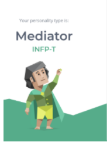 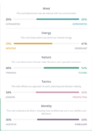
  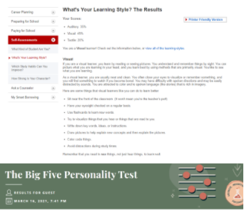 
  
  
Haowen Wang:

   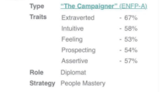
  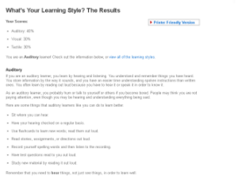 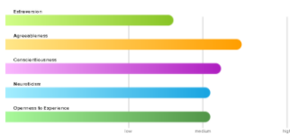
  
  
Zhenyu Huang:

  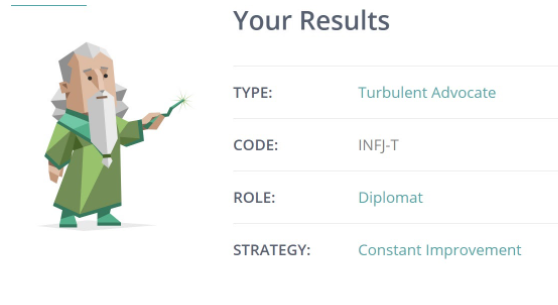
  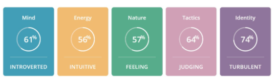
  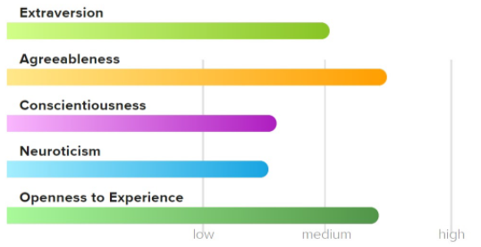
  
  
Hongwei Zheng:

  
  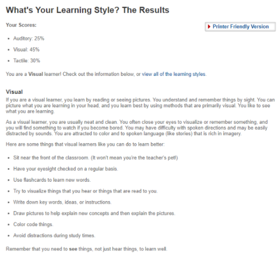
  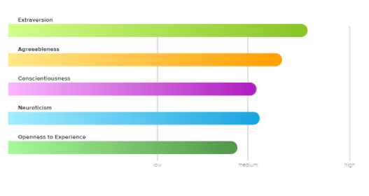
  
  
Hao Zhong:

  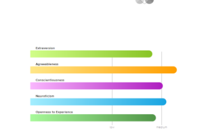
  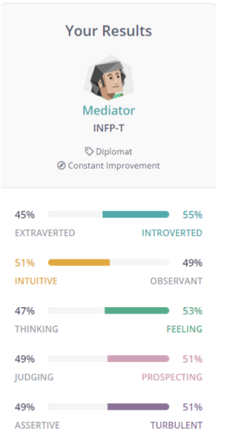
  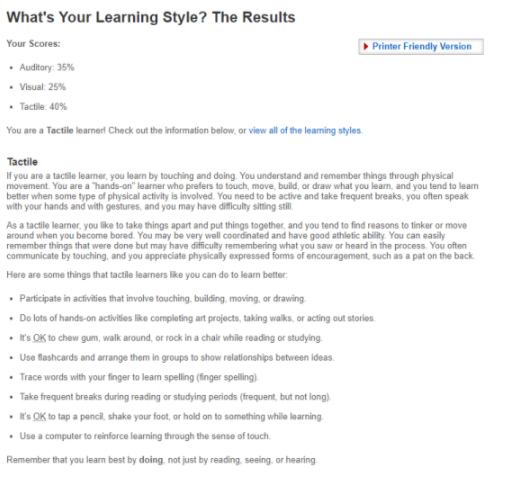
  
